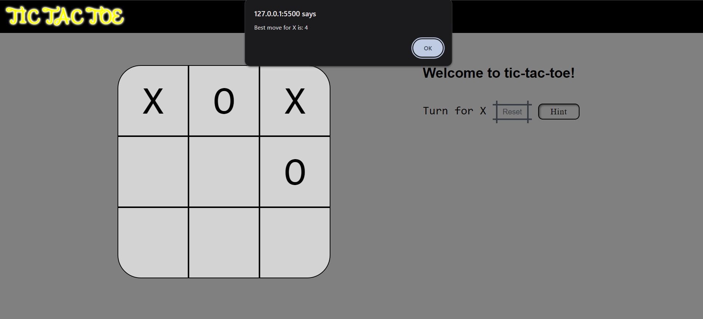

# Tic Tac Toe with Minimax Algorithm

This is a Tic Tac Toe game implemented using HTML, CSS, and JavaScript, with a hint feature powered by the minimax algorithm.

## Features

- Two-player mode.
- Hint feature suggests best move for player.
- Responsive design for various devices.

## Screenshot

(the board cells are numbered from 0-8)
